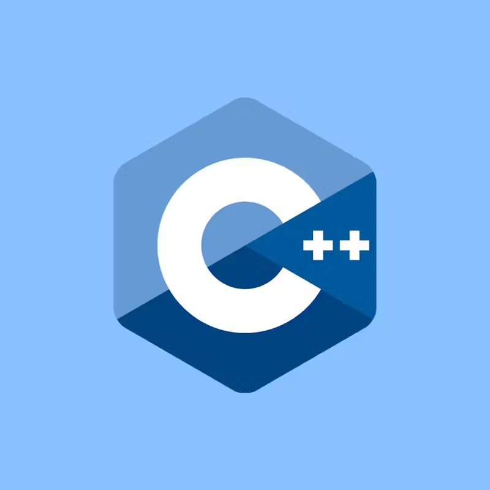

<!-- more -->

# C++前言笔记

## using 关键字

### 声明

using 声明 (using declaration) 是将命名空间中单个名字注入到当前作用域的机制，使得在当前作用域下访问另一个作用域下的成员时无需使用限定符 ::

比如

```cpp
void function(){
    using std::cout; //仅仅导入某个函数
    cout << "Hello";
}

void otherFunction(){
    cout << "Hello"; //error;
}
int main(){
    using namespace std; //如果using 某个明明空间是在某个函数内，那么它仅仅在该函数内生效
}
```

### 类型重定义

```cpp
using alias = typename
```

举例

```cpp
using fun = void (*)(int, int);
//typedef void (*fun)(int, int); //与上一句等价
using int16 = short;
//typedef short int16; //与上一句等价

int main(){
    std::cout<<sizeof(int16)<<std::endl;
}
```

### 优势

加入我们有这样的想法

```cpp
typedef std::map<int, int> map_int_t;
typedef std::map<int, std::string> map_str_t;
typedef std::map<int, bool> map_b_t;
```

C++98/03

```cpp
template<typename Val>
struct int_map{
    typedef std::map<int, Val> type;
};

int main(){
    int_map<int>::type imap;

    return 0;
}
```

C++11 之后

```cpp
template<typename Val>
using int_map_t = std::map<int, Val>;

int main(){
    int_map_t<int> imap;

    return 0;
}
```

简化了一点,聊胜于无

## 几个数据类型大小与范围

| 类型               | 字节 | 范围                      |
| ------------------ | ---- | ------------------------- |
| char               | 1    | -128 到 127 或者 0 到 255 |
| int                | 4    | -2147483648 到 2147483647 |
| unsigned short int | 2    | 0 到 65535                |

和 int 不同的是 char 在默认情况下既不是有符号也不是没有符号,是否有符号由 C++决定
可以通过

```cpp
char ch1; //可能有也可能没有
unsigned char ch2; // 无符号
signed char ch3; //有符号
```

## const

### const int _ 与 int _ const

> 不管 const 写成如何，读懂别人写的 const 和\*满天飞的类型的金科玉律是 const 默认
> 作用于其左边的东西，否则作用于其右边的东西：

例如，`const int* `const 只有右边有东西，所以 const 修饰 int 成为常量整型，然后\*再作用于常量整型。所以这是 a pointer to a constant integer（指向一个整型，不可通过该指针改变其指向的内容，但可改变指针本身所指向的地址）

`int const *`再看这个，const 左边有东西，所以 const 作用于 int，\*再作用于 int const 所以这还是 a pointer to a constant integer（同上）

`int* const`
这个 const 的左边是\*，所以 const 作用于指针（不可改变指向的地址），所以这是 a constant pointer to an integer，可以通过指针改变其所指向的内容但只能指向该地址，不可指向别的地址。

`const int* const`
这里有两个 const。左边的 const 的左边没东西，右边有 int 那么此 const 修饰 int。右边的 const 作用于\*使得指针本身变成 const（不可改变指向地址），那么这个是 a constant pointer to a constant integer，不可改变指针本身所指向的地址也不可通过指针改变其指向的内容。

`int const * const`
这里也出现了两个 const，左边都有东西，那么左边的 const 作用于 int，右边的 const 作用于\*，于是这个还是是 a constant pointer to a constant integer

### 修饰函数体

```cpp
void SetAge(int age) //可以修改类的数据成员
void SetAgeConst(int age) const //不可以修改类的数据成员
```

## lambda 表达式

### 三种捕获

```cpp
#include <iostream>
int main()
{
    int a = 3;
    int b = 5;

    // 按值来捕获
    auto func1 = [a] { std::cout << a << std::endl; };
    func1();

    // 按值来捕获
    auto func2 = [=] { std::cout << a << " " << b << std::endl; };
    func2();

    // 按引用来捕获
    auto func3 = [&a] { std::cout << a << std::endl; };
    func3();

    // 按引用来捕获
    auto func4 = [&] { std::cout << a << " " << b << std::endl; };
    func4();
}
```

### 举一个例子

在这个例子中使用`[=]`值捕获了所有的变量,但是因为是值捕获所以我们不能直接对 a 进行修改,即使 a 的值不会影响到外面

如果我们真的想在内部对 a 的值进行修改需要加上`mutable`, `-> int` 不是必须的,代表尾返回值,不过再更高版本的 C++中我们已经不需要这个写法了.

```cpp
#include <iostream>
int main() {
    int a = 3;
    int b = 4;
    auto func = [=](int x) mutable ->int {
        a++;
        std::cout << "a after modify " << a << std::endl; //a is 4
        return b;
    };
    func(b);
    std::cout << a << std::endl; // a is 3
    return 0;
}
```

## 新的字面量

c++中的`long long `是一个至少**64**位的整数,也就是可以超过 64 位.不过书上没说

```cpp
#include <iostream>
int main() {
    long long num = 65535ll;
    long long otherNum = 65535;
    auto res = num << 16;
    auto otherRes = otherNum << 16;
    std::cout << res << " " << otherRes << std::endl;
    /* 在我这里两个都是 4294901760 但是加了ll后会让c++将long long 看做是64位，如果不加可能会将其视为32位进行处理，不同的编译器可能会有不同的做法
    */
    return 0;
}
```

### 获得类型的最大值与最小值

```cpp
#include <iostream>
#include <limits>
int main() {
    std::cout << std::numeric_limits<int>::max()<< std::endl;
    //使用模版获得最大最小值而不是使用宏
    return 0;
}

```

### 内联命名空间

```cpp
#include <iostream>
namespace parent
{
    namespace child1
    {
        auto function = []() -> void
        { std::cout << "child1"; };
    } // namespace child1
    inline namespace child2
    {
        auto function = []() -> void
        {
            std::cout << "child2";
        };
    } // namespace child2

} // namespace parent

int main(){
    parent::function(); //输出child2
}
```

通过`inline`可以把自命名空间内的东西拿到父命名空间中

## 嵌套命名空间

```cpp
namespace parent::child3
{
    auto function = []() -> void
    {
        std::cout << "child3";
    };
} // namespace parent::child3

int main()
{
    parent::child3::function(); // 输出child3
}
```

使用`namespace A::B::C`这种形式避免过多的嵌套缩进

## 右值引用

TODO

# STL

## 分配器

### 简介

由于`C++`中存在有`list`，`vector`，`string`等大小会改变的容易因此需要使用分配器对内存空间进行分配和管理。

满足以下需求的类都可以成为分配器

```cpp
A::pointer //指针
A::const_pointer// 常量指针
A::reference //引用
A::const_reference //常量引用
A::value_type //值类型
A::size_type //所用内存大小的类型，表示类A所定义的分配模型中的单个对象最大尺寸的无符号整型
A::difference_type //指针差值的类型，为带符号整型，用于表示分配模型内的两个指针的差异值
```
