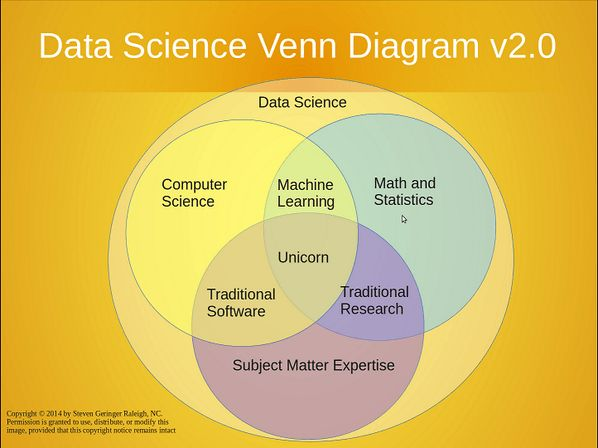
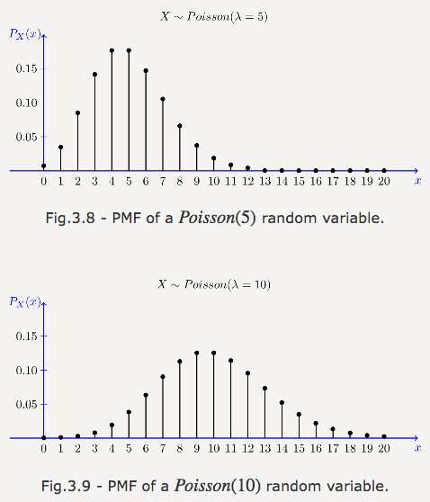

<!-- more -->
# 常见一维分布
## 伯努利分布
可以将“伯努利分布”想象为扔可能不均匀的硬币.
## 均匀分布
有多个结果，所有结果发生概率相等的分布，则是均匀分布。想象抛掷一枚匀质骰子，结果为1点到6点，出现每种点数的可能性相同。均匀分布可以由任意数目n的结果定义，甚至可以是连续分布。
## 二项分布
二项分布可以看成遵循伯努利分布的事件的结果之和。抛掷一枚均质硬币，扔20次，有多少次扔出正面
## 泊松分布
泊松分布适合于描述单位时间内随机事件发生的次数的概率分布。如某一服务设施在一定时间内受到的服务请求的次数，电话交换机接到呼叫的次数、汽车站台的候客人数、机器出现的故障数、自然灾害发生的次数、DNA序列的变异数、放射性原子核的衰变数、激光的光子数分布等等。

   

$${\displaystyle P(X=k)={\frac {e^{-\lambda }\lambda ^{k}}{k!}}}$$

## 几何分布

几何分布（英语：Geometric distribution）指的是以下两种离散型概率分布中的一种：

- 在伯努利试验中，得到一次成功所需要的试验次数得到一次成功所需要的试验次数𝑋，X的值域是{ 1, 2, 3, ... }

- 在得到第一次成功之前所经历的失败次数𝑌=𝑋−1。*Y*的值域是{ 0, 1, 2, 3, ... }

这两种分布不应该混淆。前一种形式经常被称作shifted geometric distribution；但是，为了避免歧义，最好明确地说明取值范围。

$$P(X=k)=(1-p)^{k-1} p, k=1,2, \ldots$$

说人话就是，前面都是失败的，直到那一次成功了，因此用这个公式。

## 超几何分布

公式

$${p}=\frac{C_{M}^{k} C_{N-M}^{n-k}}{C_{N}^{n}} $$

例子

设有N件产品，其中有M件次品，现在从中任取n件，问其中恰有k(k≤M)件次品的概率是多少？

解释

设N件产品中任取n件为事件A，则事件A共包含 $C_{N}^{n}$恰好取出k个残次品$C_{N}^{k}$因此在剩下的正品中你只能取$n-k$个 因此是$C_{N-k}^{n-k}$

tips

虽然几何分布和超几何分布名字相似但是他们有很大的不同,二项分布就像一件事在平面上重复多次。而超几何分布就像，一件事在每个维度上都只做一次

## 指数分布
指数分布可以用来建模平均发生率恒定、连续、独立的事件发生的间隔，比如旅客进入机场的时间间隔、电话打进客服中心的时间间隔

$$f(x)=\lambda e^{-\lambda x},x>0$$
$$f(x) =0,x<=0$$

~~为什么分开写,因为没配置好不支持/begin~~
## 正态分布
公式

$$f(x)=\frac{1}{\sqrt{2 \pi} \sigma} \mathrm{e}^{--\frac{(x \mu)^{2}}{2 \sigma^{2}}},-\infty<x<+\infty$$

# 方差,期望和协方差
## 协方差
>协方差(Covariance)在概率论和统计学中用于衡量两个变量的总体误差。它表示的是两个变量的变化趋势是否一致
