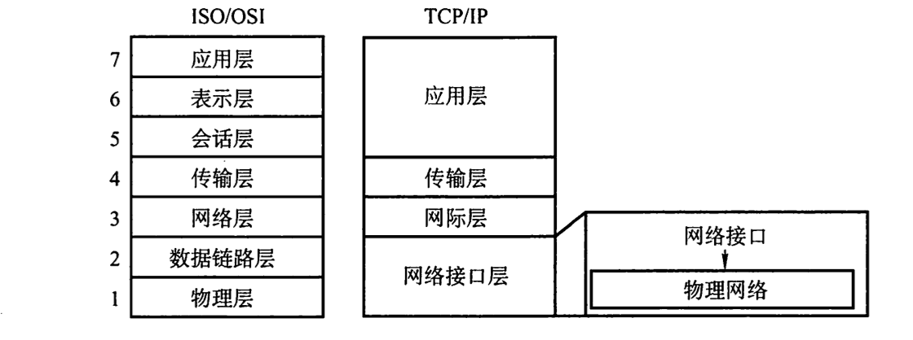
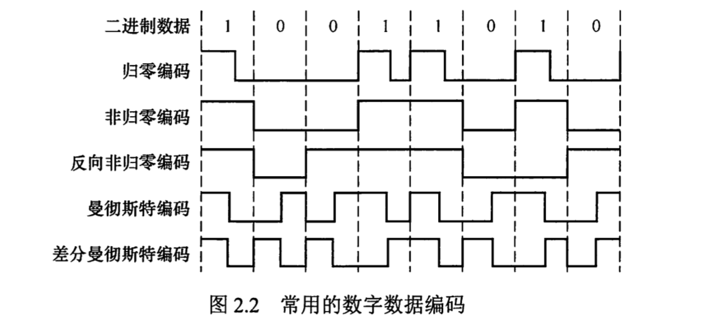
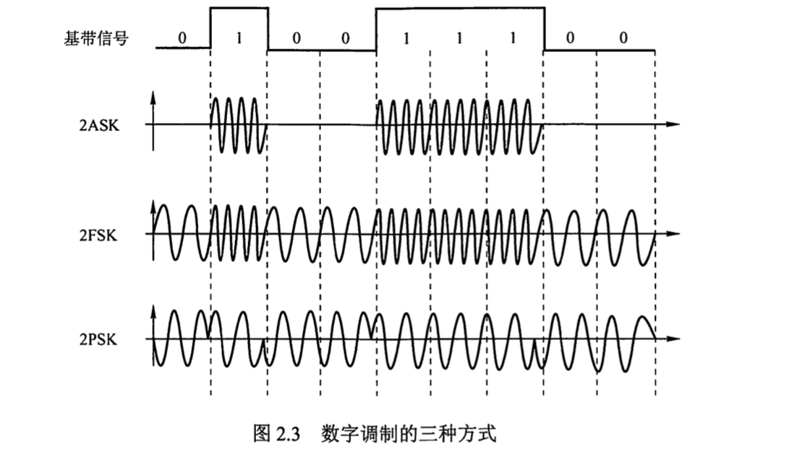
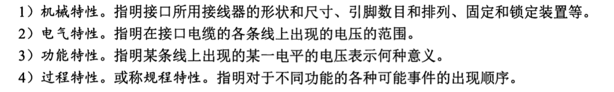
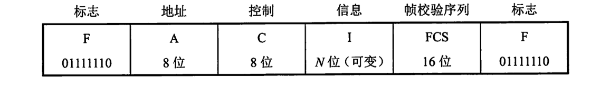
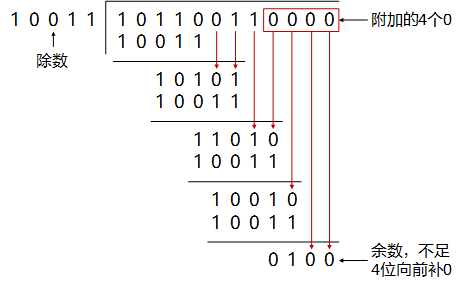
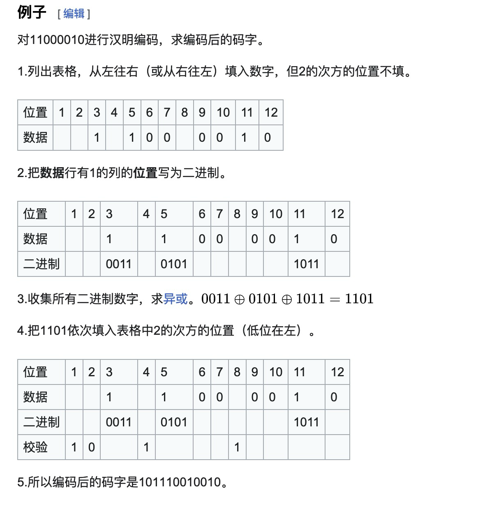
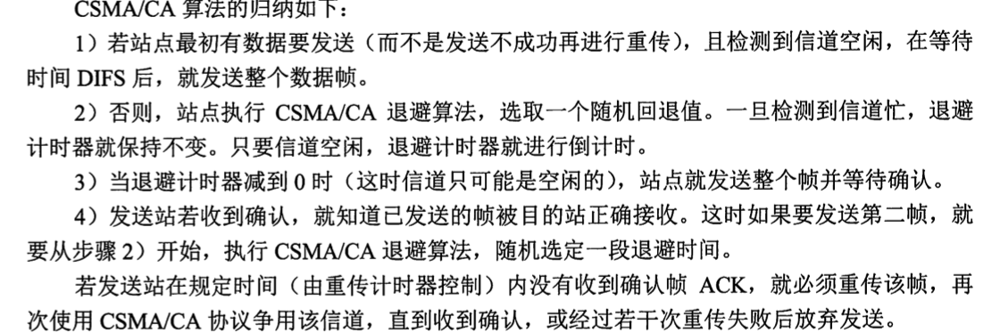
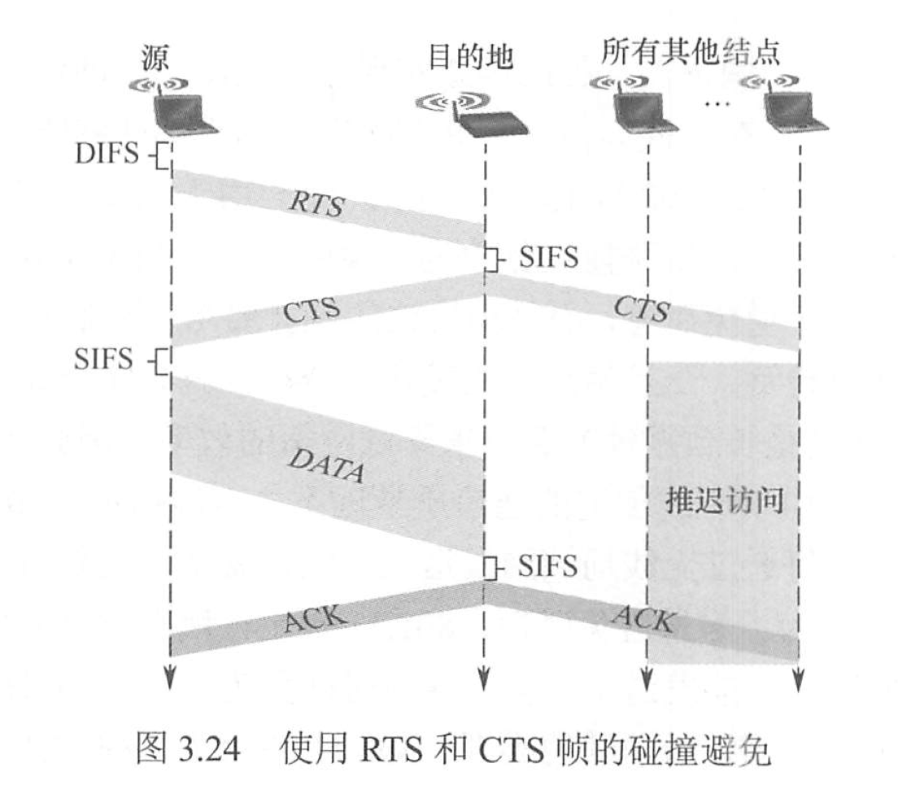
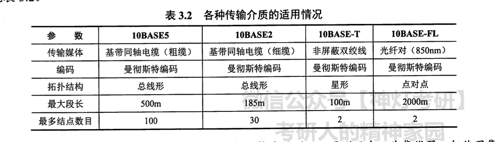

>互联网？那个东西还在吗
<!--more-->

# 序言

408考就考记忆，重点是边边拐拐的

# 一 绪论

## 计算机网络的组成

### 组成部分：

完整的计算机网络 = 硬件 + 软件 + 协议

硬件：主机(端系统)、通信链路 (如双绞线、光纤)、交换设备 (如路 由器、交换机等) 和 通信处理机 (如网卡)

软件：实现资源共享和方便用户使用

计算机网络的核心是`协议`

###  工作方式：

计算机网络 = 边缘部分 + 核心部分

边缘部分: 所有连接到因特网上、供用户直接使用的主机组成，用来进行`通信`和`资源共享`

核心部分: 大量的*网络*和连接这些网络的*路由器*组成 ， 它 为 边 缘 部 分 提 供 `连 通 性` 和` 交 换 服 务`

### 功能组成：(我觉得是重点)
计算机网络 =  通信子网 + 资源子网

通信子网 = 各种传输介质 + 通信设备 + 相应的网络协议

资源子网 = 实现资源共享功能的设备及其软件的集合

**通信子网：使网络具有 *数据传输*、*交换*、*控制* 和 *存储* 的能力**

## 几种网络构型
### 种类
总线型网络(建网容易，效率不高)

星型（便于集中控制和管理，端用户通信必须经过中央设备）

环形 （可以单环，也可以双环，**环中信号是单向传输的**）

网状

## 指标(重点)
带宽： 网络的通信线路所能传送数据的能力，即数字信道的最高数据传输速率

时延： 从网络的一端传送到另外一端所需要的总时间 时延= 发送时延 + 传播时延+处理时延+排队时延

- 发送时延 =》 所有数据上链路        分组长度/信道宽度
- 传播时延 =》电磁波从一头跑到另一头     信道长度/电磁波在信道上的传播速率
- 处理时延 =》 数据在交换节点的存储转发中进行的必要工作花的时间 分析首部，寻找路由等
- 排队时延 =》 数据进出交换节点都需要排队

时延带宽积：时延带宽积 = 传播时延  *  信道宽度 就像是水管里的水的容量一般

时延带宽积 考计算！！！！

- 信道利用率： 有数据通过的时间/总时间

## &细小知识点
不同机器上的同一层叫`对等层`，同一层的实体叫`对等实体`

每个报文PDU都由两个部分组成  数据部分SDU  控制信息 PCI

数据服务单元 SDU 为了完成用户所求的功能而传送的数据

协议控制信息 PCI 控制协议操作的信息

协议数据单元 PDU 对等层次之间传送的数据单位称为该层的PDU

## 协议 接口 服务

- 协议 = 规则的集合，**水平的必须是同层之间**
> 协议 = 语法(传输数据的格式) + 语义（所完成的功能） + 同步（执行各种操作的条件，时间关系等）
> 协议需要 =》 线路管理 + 差错控制 + 数据转换
>

- 接口 是同一节点内**相邻两层**的交换信息的连接点，不能跳
> 通过服务访问点 SAP

- 服务 下层**紧邻**的上层提供功能调用
> 上层要求下层提供服务的命令在OSI中叫`服务原语`
> 请求`Request` 服务用户 -> 服务提供者 请求完成某项工作
> 指示`Indication` 服务提供者 -> 服务用户，指示用户做某件事
> 响应 `Response` 服务用户-> 服务提供者 对请求的回应
> 证实 `Confirmation`  服务提供者 -> 服务用户 对请求的证实

*请求 <---->指示 *是一对，*响应 <--->证实*是一对

有应答服务包括四种

无应答服务 只有 **请求和指示 **

 ## TCP/IP 与 OSI模型的比较

# 二 物理层
##  通信模式等基本概念
连续变化的信号 =》 模拟信号

取值仅为有限个的 =》 数字信号

**远距离传输 使用的是串行传输 **

数字通信中信号的计量单位是**码元**

## 信源 信道 与 信宿

信源：产生和发出数据的源头

信宿：接受数据的终点

信道不能简单的视作电路

### 信道的划分
- 按传输信号种类 有模拟信道 和 数字信道两种
- 按传输介质不同 无线信道 和 有线信道

### 信道上的信号(我感觉这太细了，但是计网的这几年的抽象试卷让我不得不看)
信道上的信号
- 基带信号 -> 将数字0 1直接用不同电压表示 (基带传输)
- 宽带信号 -> 将基带信号调制后形成 **频分复用** 的 ** 模拟信号** (宽带传输)

Question
>宽带传输用的是`模拟信号`
>宽带传输用的是`频分复用`
>基带信号调制的是不同的`电压`
>

### 三种信息方式的交互

单向通信: 只有一个方向,仅需要一个信道, **无线电,广播**

半双工: 两边都可以发 但不能同时 **需要两条信道**

全双工: 两边可以同时发 需要两条信道

## &
波特率  叫 码元传输速率,表示 单位时间内系统所传输的码元个数,码元可以是多进制也可以是二进制,并且传输速率与进制无关 
> eg 1波特 表示数字系统一秒传输一个码元

信息传输速率 叫 信息速率,比特率 。 表示单位时间内的二进制码元个数 比特数 单位是比特/s bit/s

Question:
不当人的话可能会把概念混过来考，比如把波特率叫信息传输速率

## 奈氏准则 和 香农
前几年几乎送分 现在不怎么喜欢考了，

### 奈氏准则 （内忧 码间串扰）

$2Wlog_{2}V$

### 香农

$Wlog_{2}(2+S/N)$

这个算是经典题目了,必会,两者取其小就行了

## 恶心人的编码方式

### 数字编码方式
~~不仅要知道种类还要认得图和对应的英文🤮~~
- 归零编码 `RZ` 
> 重点是每个周期中间均要跳变到低电平,当然如果是0就不用跳了,压根就没起来.
>
> 归零会影响到带宽进而影响到传输效率

- 非归零编码 `NRZ` 周期不归零,但是`NRZ`无法传递时钟信号,想要传输高速同步数据需要都带有时钟线

- 反向归零编码 `NRZI` 信号翻转 -> 0 信号不变 -> 1
> 记忆点,信号翻转表示什么 `USB2.0`用的是`NRZI`编码 可能考

- 曼彻斯特编码 `Machester Encoding` 把一个码元分成两半,前高后低 -> 1 前低后高 -> 0.
> 记忆点 曼彻斯特编码所占的宽度是原始基带宽度的**两倍** , 并且`以太网`用的编码方式就是 `曼彻斯特编码`

- 差分曼彻斯特编码.  常用在`无线局域网` 前半个码元的电平和上一码元相同 -> 1 可以实现自同步,抗干扰性好

- 4B/5B 将数据流4位一组 然后按照4B/5B 转换成5位码 共32中组合 但只要16种,对应原先16种 剩下16种是控制码
> 编码规则(详细的换算太抽象了感觉不可能考了,这个能记住就差不多了)
> 
> 每个5bit码组中不多于3个"0"
> 
> 或者5bit码组中不少于2个"1"

Question
1. 最坑的应该就是让算 局域网/无线局域网 然后算出来的结果要乘2 
2. 或者问下面几个图哪一个是无线局域网的编码方式等等 

### 数字信号调制为模拟信号
~~已经连续考了两年了,不过不慌今年我乱杀~~

#### 数字调制技术
`发送端` 把 `数字信号` -> `模拟信号` 这个叫**调制**

`接受端` 把 `模拟信号` -> `数字信号` 这个叫**解调**

*可能会问哪个是对的,其中某个错误的就是搞错转换地点或者是方法的名字*

#### 四种数字调制方法🤮
1. 幅移键控 `ASK` 通过改变`振幅` 比较容易实现 *抗干扰能力差*
2. 频移键控 `FSK` 通过改变载波信号的`频率` 来表示0和1 ~~去年考过~~
3. 相移键控 `PSK` 通过改变载波信号的`相位` 来表示0和1
4. 正交振幅调制 `QAM` 在`频率` 相同的情况下 `ASK` + `PSK` => 形成的叠加信号.
> 波特率B 相位数量m  每个相位n个振幅
>
> $R=Blog_{2}(mn)$ 单位(bit/s)
---
出题点:
1. 给出单位让算QAM
2. 给图片判断信号种类 或者给信号找图片
3. 数字信号 -> 模拟信号 叫什么? `调制`

### 模拟数据编码为数字信号

#### 对于*音频* 信号的脉码调制`PCM` 
`PCM` = 采样 + 量化 + 编码

`带宽` = 信号的最高频率和最低频率之差

`采样频率` 必须 $\geq$ 最高频率
---
出题点
1. 算带宽
2. 问技术叫什么名字 或者 模拟信号 -> 数字信号叫什么 答`编码`

### 模拟信号转换成模拟信号

技术名字叫`调制` 方式是通过 频分复用 `FDM` 
**电话机和本地交换机** 用的就是模拟转模拟
---
出题点
1. 很有可能就这么问 交换机使用的信号转换方式是什么? 四个英语让你选

## 三种报文交换
### 电路交换
必须建立一条**专用**的物理通信
> 除了起点和终点,中间任意节点都是`直通方式` 路上不会产生存储转发时延
### 报文转发
单位 `报文`
报文 携带 目标地址 源地址 交换方式是`存储转发`

### 分组交换
区别
分组交换的每个小数据块都需要加上`源地址`,`目标地址` 和 `分组编号`

  - 分组到达目标节点后 需要按编号进行排序工作
  - 如果采取虚电路 但有 呼叫建立 数据传输 虚电路`释放 

---
1. 如果传送数据量大且传送时间远大于呼叫时间 应该用 **电路交换**
2. 适合计算机之间突发通信的是**分组交换** (可能是考点)
3. 虚电路是否需要完整的地址? 答:仅在连接之初需要,后面每个报文都是用较短的虚电路号
4. 数据报服务是不可靠的,可靠性由用户主机负责,而虚电路可靠性由整个网络负责

## 物理介质
### 双绞线
屏蔽双绞线`STP`

屏蔽双绞线`UTP`

1. **双绞线**局域网和传统电话网中用的最多 选择题可问
2. 长距离运输  模拟信号 -> `放大器` 放大衰竭信号 
3. 数字信号 用 `中继器` 整形 (可做考点问哪个错的故意弄乱)

### 同轴电缆
种类 50Ω 和75Ω
1. 传送基带数字信号的是 50Ω  ---> 局域网
2. 传送宽带数字信号的事 75Ω  ---> 有线电视

有良好的抗干扰性

### 光纤

1. 多模光纤 -> 近距离

2. 单模模纤 -> 远距离

## 物理接口特性

~~接口标准~~
`ELA RS232C` `ADSL` `SONET/SDH`

## 集线器
有hub组成的网络是共享式网络 每个主机在不同的网段,只能在半双工下工作

# 三 数据链路层
## 几种方式

1. 无连接无确认  ---> 实时通讯 ---> `以太网`
2. 有连接无确认  ---> 无线通信
3. 有连接有确认  ---> 对于可靠性要求较高的场合
---
可能会问以太网是什么通讯方式然后让你选

## 链路管理

### HDLC协议(不是重点了)

标准帧格式

### 差错控制
帧校验用的是`CRC`,接收端发现错误就`丢弃`,发送方`超时重传` ===> `ARQ法`

### CRC的计算方法(重点)

$g(x)=x^4+x+1$ 这个式子的生成多项式就是10011 

例子
原始数据 10110011 因为g(x)的最高次是4 所以原始数据往左位移4位 ,补0

接着用 101100110000 除 10011

这里要用到模除 上下相同0  不同1  没用到的拉下来

### 汉明码(重点)

## 流量控制
### 名词
1. 一组连续的可以发送的序号 -> 发送窗口
2. 一组连续的可以接收的序号 -> 接受窗口
> 当接收端接收到不在接收窗口的帧 就丢弃
>
>注意 序号是循环的比如 0 1 2 3 0 1 2 3 1

### 后退N帧协议 GBN

发送窗口大小是$2^n -1$

### 选择重传协议 SR
发送窗口大小是 $2^{n-1}$

### 信道利用率

发送周期:发送方从`开始发送`到收到第一个`确认帧`

信道利用率 = (发送的数据量L /传输速度C)/ 总时间T

信道吞吐率 = 信道利用率/发送方的发送速率

## 介质访问控制
介质访问控制层`MAC`$\subset$数据链路层

主要路线有两种对于介质本身进行物理上的划分 和 时间上的划分技术

### 名词

1. 频分多路复用`FDM` 把多路基带信号**调制**到不同**频率**的载波上. 总合不能超过总带宽,相邻信道间要加入*保护频带* 防止干扰
2. 时分复用`TDM`
3. 统计时分多路复用`STDM` 动态分割时间
4. 波分多路复用`WDM`
5. 码分多路复用`CDM` 重点可考计算  注 `CDMA`码分多址

## 码分复用计算
假设我们有 `A` `B` `C` 三个站点,C是服务器,A B 是客户机 均向C发送

一开始A B 会被分别指派一个`码片序列`,有时候题目会问你怎么算或者下面哪一个是

假如A的码片序列是 `00011011` 那么当 A想发送1时 就发 `00011011` 相应的如果A想发送0 就发送序列的反码`11100100`

其中 `1` 用 `+1` ,`0` 用 `-1`表示 为了方便计算 

**规格化内积**的计算公式如下

$$S\cdot T \equiv \frac{1}{m}\sum_{i=1}^{m} S_{i} T_{i}$$
也就是说另外一个站的码片序列必须得满足这个式子
这里已经计算出B的是
{-1,-1,+1,-1,+1,+1,+1,-1}

A是
{-1,-1,-1,+1,+1,-1,+1,+1}

发的是线性叠加的

假如两个都发1

就是
{-2,-2,0,0,2,0,2,0}

王道书上给的例子是B发0
B是`11010001`

叠加后的结果是(0 0 -2 2 0 -2 0 2) 

### 分离
利用的是如下性质
1. 任意一个向量与自身内积 => 1
2. 任意一个向量与自身的补码内积 => -1
3. 任意一个向量与其他码片向量 内积=>0

因此如果我们想要知道A发了什么 只需要将A的码片向量乘叠加向量就行了

比如$A \cdot (A+B)$ A与其他所有的向量内积会变为0 这样我们就提出了A的值 如果是+1 就代表发了1 -1 就是 0

## 随机介质访问控制(常考)

### 纯ALOHA协议
想发就发,纯看脸

相关计算公式(还没考过😱)

`网络负载`:T0时间内所有站点**发送成功**和**没成功而重传**的帧数 符号为G

`纯ALOHA`的平均网络负载量是$S=Ge^{-2G}$ 极大值为G=0.5 S约为0.184

### 时隙ALOHA
时隙ALOHA 把所有站点综合考虑设定了一个$T_{0}$作为时隙,$T_{0}$满足能发一个但不会让你发两个

每个主机都只能在每个$T_{0}$到来的开头才能发,如果错过了就等下一个

网络负载量是$S=Ge^{-G}$ 相比较纯ALOHA提高了一倍

## CSMA
CSMA是ALOHA的改进,比较ALOHA有了一个`载波侦听装置`

有三种形式的CSMA,主要考第三种
1. 1-坚持 CSMA
2. 非坚持 CSMA
3. p-坚持 CSMA

### 细节
p-坚持CSMA,用于`时分信道`,工作流程是
> 发送之前先听,如果忙就**持续侦听**(不是不侦听了,也不是一直听,而是下个间隙开始再听听看,是时分信道嘛)
>
> 如果信道空闲,则p概率发,1-p推迟到下个间隙,下个间隙到了再看看空不空,空的话也是p概率发 1-p不发,忙的话就等到下个间隙再听了

## 载波侦听堵路访问/碰撞协议(CSMA/CD)
`ALOHA` 进化---> `CSMA` 超进化--->`CSMA/CD`
### 碰撞检测

以太网-> `51.2`微秒作为最短帧长 

10Mb/s的以太网 争用期可发送512bit 也就是64B,
争用期没发生冲突 后续也就不会发生冲突了,因为已经占领了信道,别的设备会去检测的
### 截断二进制指数退避算法
1. 基本退避时间$2\tau$ -> 一个争用期 ,注意有时候题目只告诉你一个$\tau$要记得乘2
2. 设k为重传次数 k = min[重传次数,10] ,k最大为10不会一直增大
3. 从$[0,1,3,\cdots,2^{k}-1]$随机挑一个, 把这个数乘争用期
4. 当重传16次仍然不成功,则丢弃,并向高层报告

## 碰撞避免 802.11标准 `CSMA/CA`
碰撞避免不能完全避免碰撞

`802.11`使用链路层的确认/重传`ARQ`,收到了确认才能发下一帧

### 帧间间隔🤮
1. SIFS(短IFS)最短的IFS
   >ACK,CTS,分片后的数据帧,回答AP探寻的帧都用SIFS
2. PIFS(点协调IFS) 中等长度 
    >在PCF操作中用 
3. DIFS(分布式协调IFS) 最长的IFS
    >用于异步帧竞争访问的时延
### 退避算法

## 隐蔽站

1. CSMA/CD 可以检测冲突,CSMA/CA发送数据的同时不能检测是否有冲突
2. CSMA/CD 适用 `总线型以太网`,CSMA/CA适用`802.11a/b/g/n`
3. CSMA/CD 通过电压方式检测, 
4. CSMA/CA `能量检测`,`载波检测`,`能量载波混合检测`

## 令牌环网
### 注意点
1. 网络空闲时 只有令牌在传递
2. 如果有数据站点想要发送数据,拿到令牌后,修改令牌的数据位,使其变成一个数据帧发送出去
3. 到达目的地后,重新产生令牌
4. 令牌传递适用于**负载很高**的网络

## 局域网
### 特点
1. 各站点共享较高的总带宽
2. 各站点为平等关系
3. 能够进行广播和组播
---
考点

`CSMA/CD`,`令牌总线` ===> `总线型以太网`

`令牌环` ===> `环形以太网`

以太网 逻辑结构是 `总线型`,
物理结构 是`星型`或者`拓展星型`

令牌环`IEEE 802.5` 逻辑是`环形` 物理是`星型`

FDDI`IEEE 802.8` 光纤分布数字接口,逻辑环形,物理双环

`IEEE802标准` 把数据链路层 

>--> 媒体接入控制子层(MAC) 
>
>--> 逻辑链路控制子层(LLC)

## 以太网传输介质
🤮可能选择题会问

`10BASE-T`非屏蔽双绞线 ,记一下这个差不多了,剩下的再问有点不礼貌了

## 以太网
协议是`IEEE 802.3` 
1. 以太网采取无连接的方式发送,不对数据帧编号,也不对数据帧确认,尽最大努力交付
2. 曼彻斯特编码

# 附录 (一)协议,名词和概念
~~说的好像不常见的就不考一样~~

1. 数据链路层 以太网最大帧长度 1518 字节 
2. 最大传送单元叫`MTU` 和最大帧长度不一样 MTU的范围是 46~1500字节
3. `OSI`体系中数据链路层 ---> 流量控制
4. `TCP/IP` 传输层 ---> 流量控制
5. `CSMA/CD` 碰撞检测
6. `CSMA/CA` 碰撞避免

